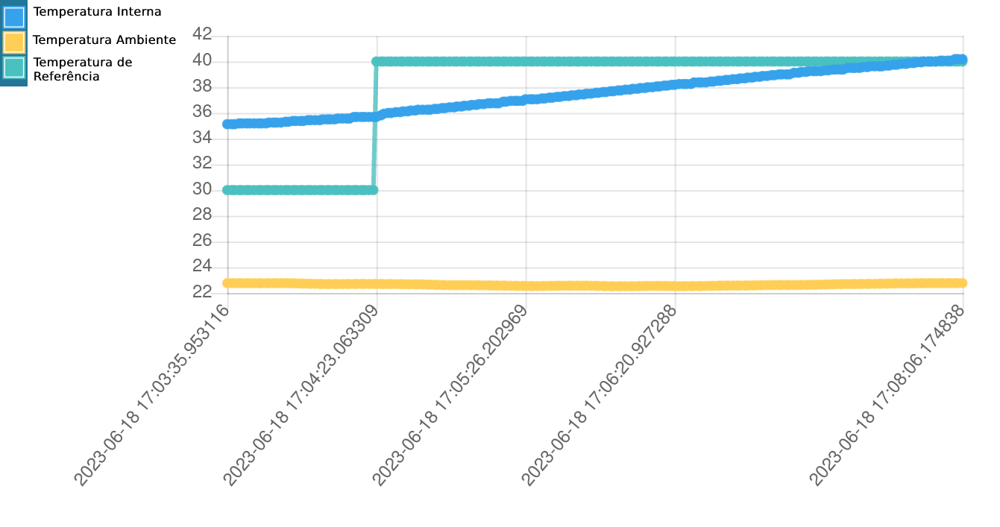

# Trabalho 2 - 2023/1
Aluno: Christian Fleury Alencar Siqueira
Matrícula: 190011602

# Vídeo

Link do vídeo: https://youtu.be/Z9nnpDg98kw <br>
# Encoder
O encoder se encontra na pasta ./encoder, nessa pasta existem 3 arquivos, ```encoder.py```, ```encoder_old.py```, ```menu.py```.<br>
Para rodar o encoder, basta rodar o arquivo ```encoder.py```, através do comando ```python3 encoder/encoder.py```. <br>

Os pinos da GPIO do encoder podem ser setados no arquivo ```encoder.py``` nas primeiras linhas. <br>

O arquivo ```encoder_old.py``` é a minha implementação do encoder testada em sala, porém ainda sem o menu. Como eu não consegui testar o menu em sala, deixei o ```encoder_old.py``` para demonstrar o funcionamento do encoder caso o ```encoder.py``` não funcione.

# Como rodar

Para roda o programa, basta instalar as dependências ```pip3 install -r requirements.txt``` (o arquivo requirements se encontra na pasta raiz), e depois rodar o arquivo main.py. ```python3 src/main.py``` <br>

# Como usar

Primeiramente, clique em Ligar, assim o programa começara a funcionar, enviando a temperatura ambiente para o dash e aguardando outros comandos. <br><br>

Para esquentar algo, selecione o tempo e a temperatura e deplois clique em iniciar. Note que sem tempo selecionado não irá acontecer nada. <br><br>

Pode também ser utilizado um modo automatico aleatório, basta clicar no modo automático e depois clicar em iniciar. O tempo e temperatura pré-definidos aparecerão assim que o usuário iniciar.

# Funcionamento

O forno irá esquentar até a temperatura de referência (ou algo próximo em um limite de 5%), assim que chegar nesse ponto, ele irá manter a temperatura e o timer do tempo definido começara a contar. <br>

Uma vez que o timer chega a 0, a airfryer irá esfriar até a temperatura ambiente (ou algo próximo em um limite de 20%).

# Logs e experimentos

O programa gera logs na pasta raiz em um arquivo chamado ```log.csv```. Foram feitos 3 experimentos com os logs gerados. <br> <br>


## Experimento 1

O primeiro experimento foi de um cenário em que comecei já com o forno quente (maior que a temperatura de referência). <br>




Como visto nos gráficos, a temperatura interna começa acima da temperatura de referência, isso faz com que inicialmente, a ventoinha seja ativada em 100%, isso não reflete na temperatura pois provavelmente a ventoinha estava estragada no momento do experimento. <br>

Após isso aumentei a temperatura de referência para ficar acima da temperatura interna, e ai sim podemos ver os sinais do resistor em ação, juntamente com o aumento da temperatura.<br>

## Experimento 2

O segundo experimento foi manual de um cenário quase ideal (se não fosse o resfriamento lento). <br>


A temperatura sobe até a referência, fica um tempo lá e depois desce resfriando lentamente. <br>

No grafico de sinais fica facil ver a potência do resistor diminuindo de acordo com a proximidade com a temperatura de referência, até chegar no resfriamento. <br>

## Experimento 3

